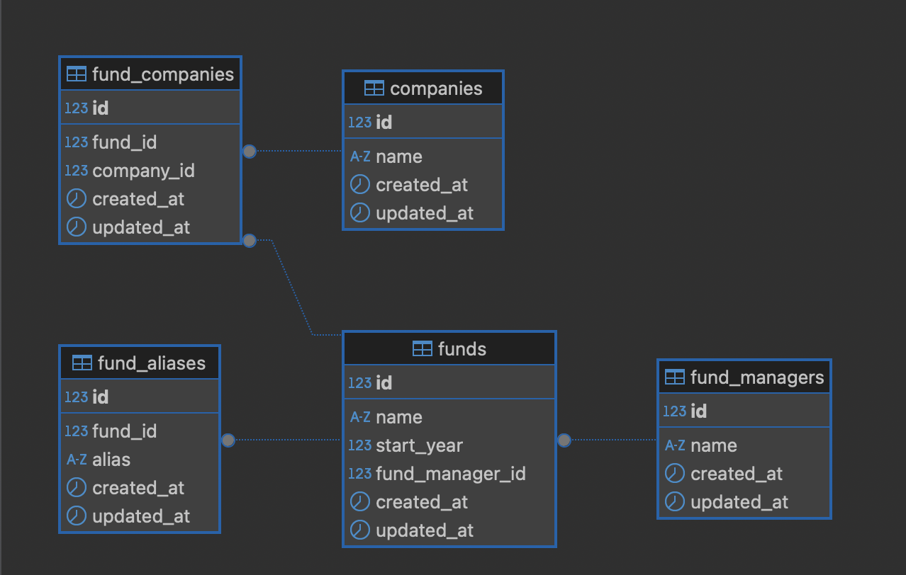
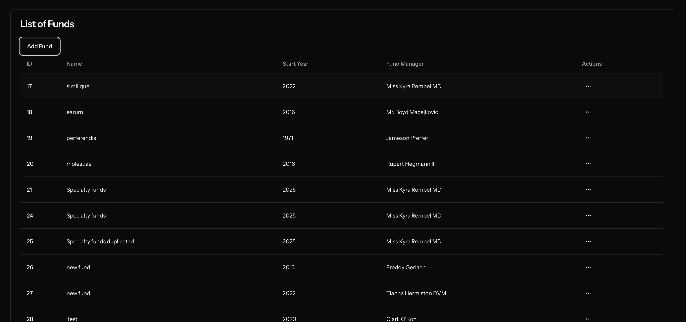
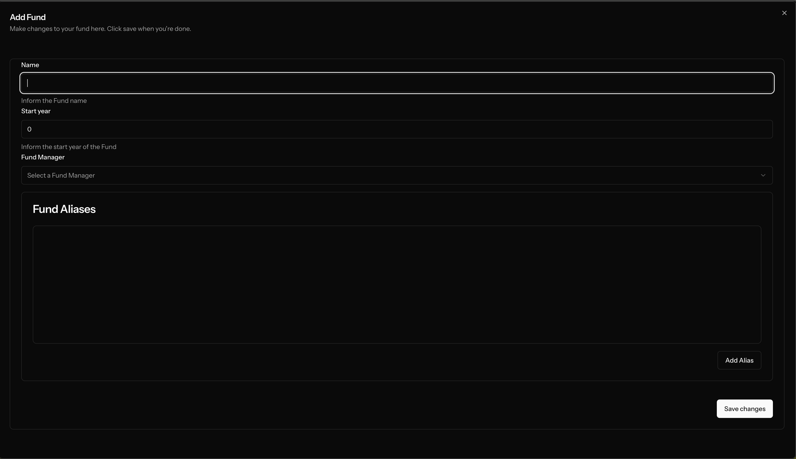

# Canoe Challenge

### Canoe Intelligence - Sr. Software Engineer Technical Assessment

- The objective of this project is to demonstrate the technical skills for the assessment proposed by the Canoe Intelligence company.
- You can find the detailed project requirements in the [PDF file](docs/canoe-intelligence-sr.-software-engineer-tech-assessment.pdf) located in the `docs` directory.

ER Diagram:


## Prerequisites

- Docker & Docker Compose
- PHP 8.3+
- Composer

## Getting Started

### 1- Clone the Repository
```bash
git clone https://github.com/danrfiuza/canoe-challenge.git
cd canoe-challenge
```

### 2- Install Dependencies
```bash
composer install
```

### 3- Configure Environment
Copy the `.env.example` to `.env` and configure your environment variables:
```bash
cp .env.example .env
```

Set your database credentials and any other required configurations.

### 4- Start the Application
Laravel Sail provides a simple way to run your Laravel application using Docker.

First, install the Sail dependencies:
```bash
php artisan sail:install
```

Start the Docker containers:
```bash
./vendor/bin/sail up
```

To run in detached mode:
```bash
./vendor/bin/sail up -d
```

### 5- Database Migration
Run the database migrations:
```bash
./vendor/bin/sail artisan migrate
```

### 6- Seed Database (Optional)
A initial data seed will be created

```bash
./vendor/bin/sail artisan db:seed
```

### 7- Running broadcast server
To check execution of the notifications is necessary to start the following services:

To start reverb server (broadcast):
```bash
./vendor/bin/sail artisan reverb:start
```
To start queue listener:
```bash
./vendor/bin/sail artisan queue:listen
```

### 7- Start the frontend
```
sail npm install && npm run dev
```




---
## Testing API Endpoints
Use tools like **Postman** or **Insomnia** to test API endpoints.
Default API URL: `http://localhost/api`

## API Documentation
For API endpoints documentation, visit `http://localhost/docs/api`.

## Running Tests
To execute tests:
```bash
./vendor/bin/sail artisan test
```

## Useful Commands
| Command                         | Description           |
|--------------------------------|---------------------|
| `sail up`                     | Start containers    |
| `sail down`                   | Stop containers     |
| `sail artisan migrate`        | Run migrations      |
| `sail artisan db:seed`        | Seed database       |
| `sail npm install`            | Install Node dependencies |